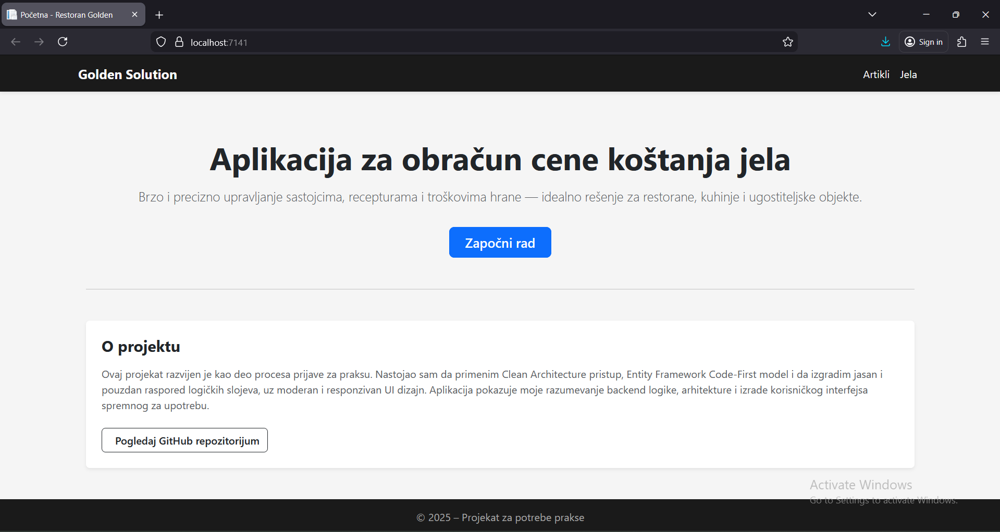
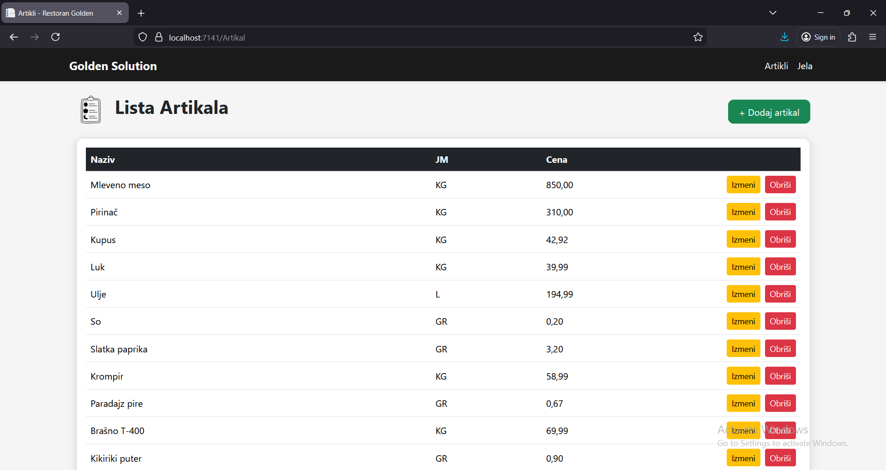
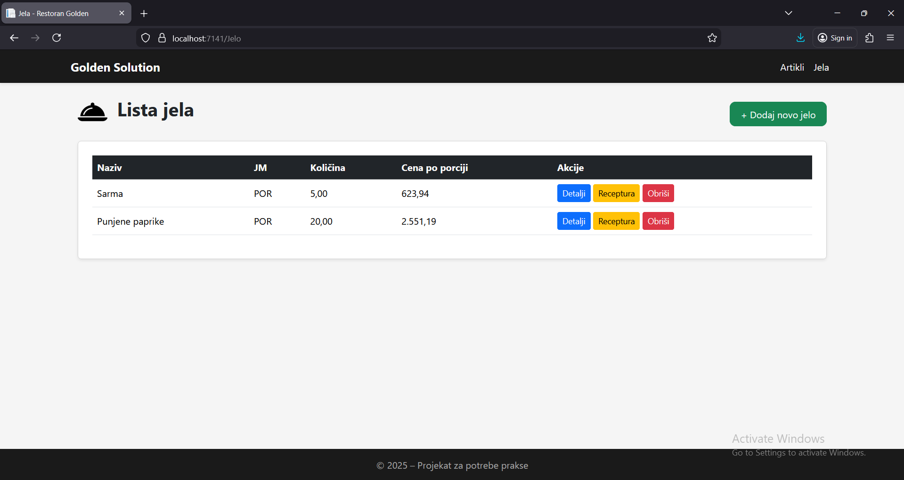
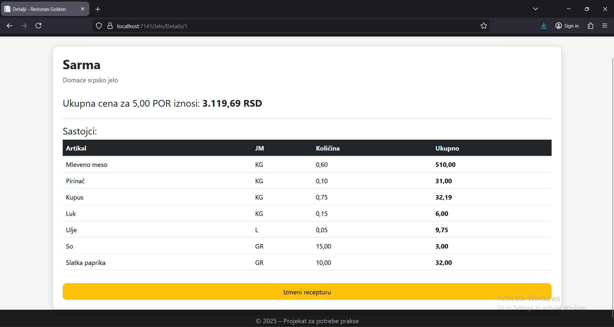

# Aplikacija za obracun cena gotovih jela

Ovo je ASP.NET Core MVC aplikacija razvijena u skladu sa Clean Architecture principima, koja omogućava vođenje evidencije i obračun cene koštanja gotovih jela. Sistem omogućava unos artikala, definisanje receptura i automatski proračun cene po porciji na osnovu utrošenih sastojaka, kao ukupnu cenu za traženi broj porcija. Aplikacija je dizajnirana da bude laka za korišćenje i responzivna, sa jasnom podelom na slojeve. 

## Tehnologije
- ASP.NET Core MVC
- Entity Framework (Code-First)
- Microsoft SQL Server
- Clean Architecture
- Bootstrap 5
- HTML
- CSS
- JavaScript
- C#

## Alati za razvoj
- Visual Studio 2022
- SQL Server Management Studio (SSMS)

## Arhitektura projekta
Projekat koristi Clean Architecture podeljen na:

- **Domain** – entiteti
- **Application** – DTO-ovi, interfejsi, maperi
- **Infrastructure** – EF Core implementacije, DbContext, servisi
- **WebUI** – MVC kontroleri, pogledi i UI

Ovako definisana struktura omogućava jasnu modularnost, testabilnost i lako održavanje.

## Pokretanje projekta
1. Klonirati repozitorijum
2. Pokrenuti rešenje u Visual Studiu 2022
3. Otvoriti SSMS i kreirati novu bazu GoldenDb
4. Zatim otvoriti novi Query i nalepiti poslatu skriptu
5. Execute
6. Podesiti Connection String u appsettings.json
7. Pokrenuti WebUI projekat

## Sceenshot-ovi

## Autor
- Nemanja Stojadinović
- Apsolvent na Fakultetu tehničkih nauka u Čačku
